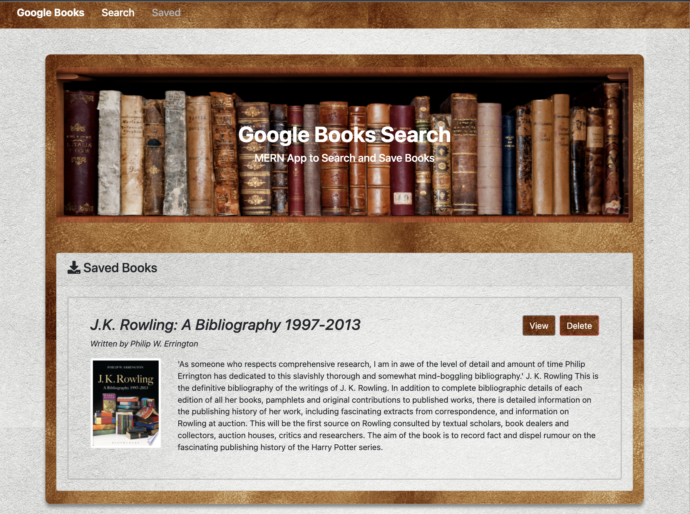

# Google Books Search MERN Application

# Description

The Google Books Search MERN app allows users to search for books of interest via the Google Books API and view, save books they wish to read. Users can get all saved books and they can view or delete those saved books.

#### **[Deployed Application](https://google-books-search-app-mern.herokuapp.com/)**

# Table of Contents

* [Demo](#demo)
* [Preview](#preview)
* [Installation](#installation)
* [Features](#features)
* [Technology](#technology)
* [Contribution](#contribution)
* [Questions](#Questions)

# Demo : 

# Preview : 

|Medium Devices/ Laptop|Small Devices/ Tablet|Extra Small Devices/Phone
|--|--|--
|||

### Search and Saved page :

|Search Books|Saved Books|
|--|--
||

# Installation

1. Clone the [repo](https://github.com/GauriKhandke/google-books-search-react) to your local machine.

2. On your local repo, run `npm install` to install dependencies.

3. Run `npm start` to start the application. Your app should now be running on <http://localhost:3000>.

# Features

1. User can search for a book user wish to read. It will give list of all books available for search query.
2. User can view individual book. View can redirect user to Google Books page.
3. User can save books user wish to read. 
4. User can get all saved books in 'Saved' link in navigation bar.
5. User can view or delete each saved book.
6. Application is deployed on heroku.

# Technology:

#### 1. [React](https://reactjs.org/):
* React makes it painless to create interactive UIs. Design simple views for each state in your application, and React will efficiently update and render just the right components when your data changes.

#### 2. [Express](https://expressjs.com/):
* Express is a minimal and flexible Node.js web application framework that provides a robust set of features to develop web and mobile applications. It facilitates the rapid development of Node based Web applications.

#### 3. [MongoDB](https://www.mongodb.com/):
* MongoDB is a general purpose, document-based, distributed database built for modern application developers and for the cloud era.

#### 4. [Node.js ](https://nodejs.org/en/):
* Node.js is an open-source and cross-platform JavaScript runtime environment.A Node.js app is run in a single process, without creating a new thread for every request.

#### 5. [Google Books API](https://developers.google.com/books)

#### 6. [Axios](https://www.npmjs.com/package/axios)

#### 7. [Bootstrap](https://getbootstrap.com/)

#### 8. [Heroku](https://www.heroku.com/)

# License

This project is licensed under MIT License.

# Contribution

Please let me know how I can improve this project. Issues and pull requests are always welcome.

# Questions :
* If you have any questions about the repo, please submit issue [here](https://github.com/GauriKhandke/google-books-search-react/issues/new) or [email](mailto:khandkegauri@gmail.com) me.